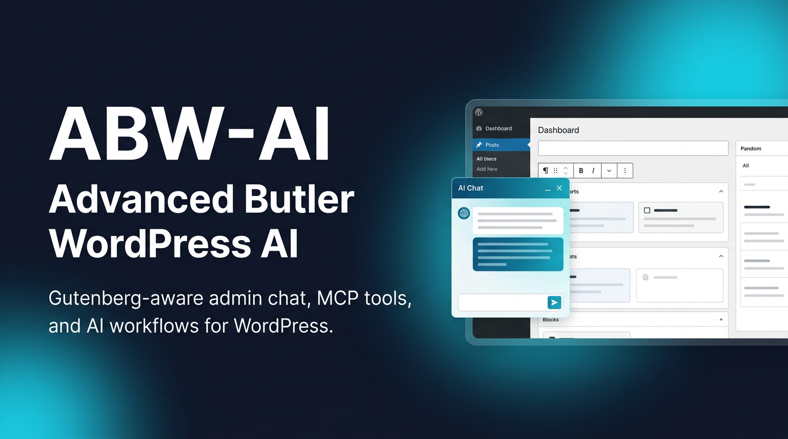
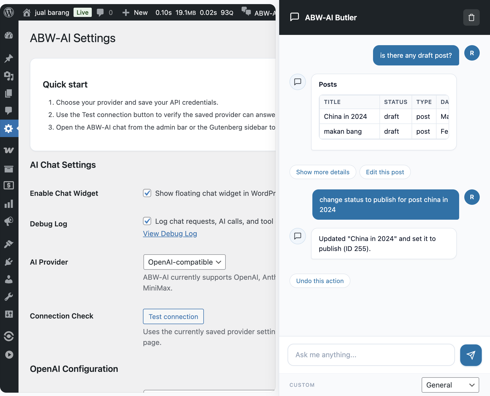
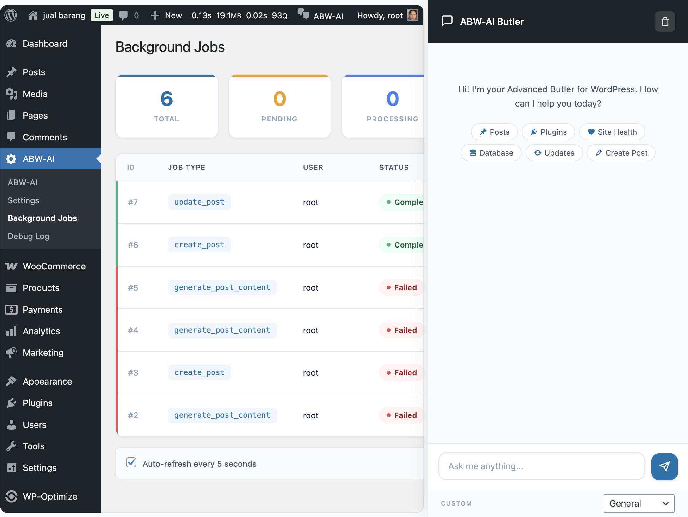
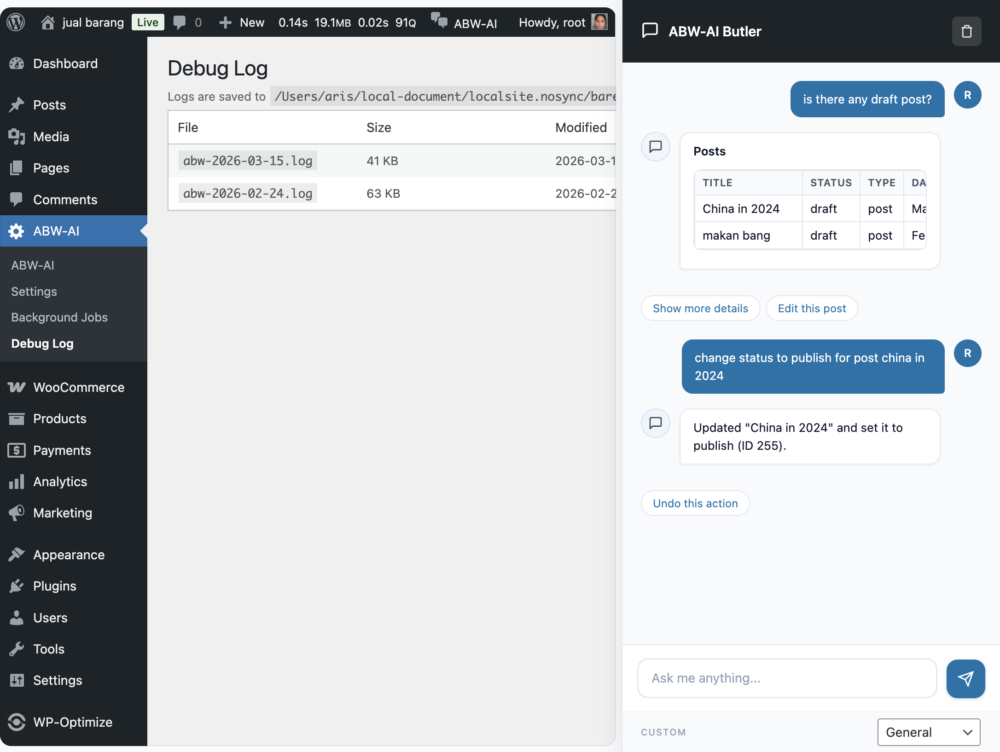

# ABW-AI - Advanced Butler WordPress AI

**Enhanced for [MiniMax](https://www.minimax.io)**

An AI-powered assistant for WordPress that lives inside your admin dashboard. It can manage posts, users, media, plugins, themes, updates, menus, WooCommerce orders, and more through natural language conversation. It also integrates natively with the WordPress Block Editor (Gutenberg) so you can ask it to write, edit, and structure content directly inside the editor.

ABW-AI is enhanced for **MiniMax** models, taking advantage of their 1M token context window, fast inference speeds, and cost-effective pricing -- making it practical to send full page layouts and long editor contexts to the AI without worrying about token limits or response latency.

## Visual Preview

Repository preview assets for the WordPress.org listing are stored in `wporg-assets/`.



### Icon


### Screenshots

#### Settings And Live Chat



#### Background Jobs Dashboard



#### Debug Log And Chat History



---

> **Sponsored by [MiniMax](https://www.minimax.io)** -- high-performance AI models with 1M token context, agentic tool calling, and OpenAI-compatible APIs. Get your API key at [platform.minimax.io](https://platform.minimax.io).

---

## Requirements

- WordPress 6.9+
- PHP 7.4+
- An AI provider API key (see [Supported Providers](#supported-ai-providers))
- Node.js 18+ (only needed to rebuild the block editor sidebar from source)

Optional:
- **WooCommerce** -- enables product and order management tools

## Supported AI Providers

| Provider | Latest Model | Context Window | Output Limit | Pricing (per 1M tokens) |
|----------|-------------|---------------|-------------|------------------------|
| **MiniMax** (recommended) | MiniMax-M2.5 | **1,000,000 tokens** | 128K tokens | $0.30 input / $1.20 output |
| OpenAI | GPT-5.2 | 256K tokens | 128K tokens | Varies by variant |
| Anthropic | Claude Opus 4.6 | 1,000,000 tokens (beta) | 32K tokens | $5.00 input / $25.00 output |
| Custom | Any OpenAI-compatible endpoint | Varies | Varies | -- |

### Why MiniMax?

ABW-AI sends the full block editor state (every block, its type, attributes, and content) as context with each message. This can easily reach tens of thousands of tokens for content-rich pages. MiniMax models are a strong fit because:

- **1M token context window** -- fits even the largest pages without truncation, with room to spare for conversation history
- **128K token output** -- can generate entire articles or full page layouts in a single response
- **100 tokens/second** on highspeed models -- fast responses even with large context
- **$0.30 / 1M input tokens** -- roughly 8% of the cost of comparable frontier models, practical for frequent use
- **OpenAI-compatible API** -- works out of the box with ABW-AI's custom provider, no code changes needed
- **Agentic tool calling** -- reliable function calling for 90+ WordPress management tools
- **Vision support** -- M2.5 supports image input, enabling future multimodal workflows

### Model Variants

| Model | Speed | Best For |
|-------|-------|----------|
| `MiniMax-M2.5` | ~60 tokens/sec | Complex tasks, coding, long-form content |
| `MiniMax-M2.5-highspeed` | ~100 tokens/sec | Quick edits, conversational use, real-time interactions |

## Installation

1. Download or clone this repository into `wp-content/plugins/abw-ai/`.
2. Activate the plugin from **Plugins > Installed Plugins**.
3. Go to **ABW-AI > Settings** and configure your AI provider.
4. The chat sidebar appears in the admin bar across all admin pages.

### Quick Start with MiniMax

1. Get an API key from [platform.minimax.io](https://platform.minimax.io)
2. In **ABW-AI > Settings**, select **Custom Provider**
3. Set the fields:
   - **API Key**: your MiniMax API key
   - **API Endpoint**: `https://api.minimax.io/v1/chat/completions`
   - **Model Name**: `MiniMax-M2.5` (or `MiniMax-M2.5-highspeed` for faster responses)
4. Save and start chatting.

### Building the Block Editor Sidebar (optional)

The `build/` directory is included in the repository, so this step is only needed if you modify files in `src/`.

```bash
cd wp-content/plugins/abw-ai
npm install
npm run build
```

For development with live rebuilds:

```bash
npm start
```

## Features

### AI Chat Sidebar

A persistent chat sidebar available on every WordPress admin page. Toggle it from the admin bar. It supports:

- Multi-provider AI (MiniMax, OpenAI, Anthropic, or any OpenAI-compatible endpoint)
- Markdown rendering (headings, lists, tables, code blocks, links)
- Conversation history (persisted per user)
- Context-aware -- the AI knows which admin page you're on
- Background job processing for long-running operations

### Block Editor Integration

When you open a post or page in the Gutenberg editor, the chat sidebar becomes a native **PluginSidebar** panel with full block manipulation capabilities:

- **Reads the editor** -- serializes all blocks into a text representation so the AI understands your content (no vision required)
- **Inserts blocks** -- generates HTML that is automatically converted to WordPress blocks
- **Replaces content** -- can rewrite an entire post or replace individual blocks
- **Removes blocks** -- delete blocks by index
- **Saves the post** -- triggers a save from the sidebar
- **Updates post details** -- change title, status, or excerpt

The AI sees a structured view of your blocks like this:

```
Editor Context:
- Post ID: 42
- Post Title: "My Blog Post"
- Post Type: post
- Post Status: draft
- Block Count: 5

Blocks:
[0] core/heading (level=2): "Introduction"
[1] core/paragraph: "This is the first paragraph..."
[2] core/image (id=123, alt="Photo"): [image: photo.jpg]
[3] core/list (ordered=false):
  - "Item one"
  - "Item two"
[4] core/columns (columns=2):
  [4.0] core/column:
    [4.0.0] core/paragraph: "Left column"
  [4.1] core/column:
    [4.1.0] core/paragraph: "Right column"
```

This means even AI models without vision can understand and manipulate your page layout. MiniMax's 1M token context window ensures this representation is never truncated, even for the most complex pages.

### WordPress Management Tools (90+)

All available as AI tools the assistant can call during conversation:

| Category | Tools |
|----------|-------|
| **Posts & Pages** | List, get, create, update, delete posts/pages |
| **Users** | List, get, create, update, delete users |
| **Media** | List, upload (URL or base64), update, delete media |
| **Comments** | List, moderate (approve, hold, spam, trash) |
| **Plugins** | List, activate, deactivate, check updates, update |
| **Themes** | List, activate, check updates, update |
| **Taxonomies** | List taxonomies, create/update/delete terms |
| **Menus** | Create menus, add/update/delete items, assign locations |
| **Site Options** | Get/update whitelisted options, reading settings |
| **Search & Analytics** | Search content, post stats, popular content, recent activity |
| **Bulk Operations** | Bulk update/delete posts, find & replace, bulk moderate comments |
| **Site Health** | Health status and diagnostics |
| **Block Editor** | Insert, replace, update, remove blocks; save post; update title/status |
| **Block Themes** | List block patterns and template parts |
| **WooCommerce** | List/get products and orders, update statuses |

### Update Management (Check + Apply)

ABW-AI can both detect and apply updates for plugins and themes:

- **Check updates**: finds available plugin/theme updates with current and target versions
- **Apply updates**: upgrades a specific plugin/theme or all available updates
- **Clear result reporting**: reports what was updated, what was already current, and any failures

Example prompts:

- `Check for plugin and theme updates`
- `Update the Twenty Twenty-One theme`
- `Update all available plugin and theme updates`

### Reliable Multi-Step Actions

The assistant uses an agentic multi-step loop for action requests (for example: list -> select -> update/delete).  
For operational requests, it is designed to complete the action workflow end-to-end rather than stopping after a read-only step.

### AI Writing & SEO Tools

- Generate blog post content from a topic
- Improve and rewrite existing content
- Generate SEO meta titles and descriptions
- Translate content to other languages
- Generate FAQ sections
- Generate schema markup (JSON-LD)
- Summarize content
- Generate social media posts
- Analyze content sentiment
- Detect content language
- Check content accessibility
- Generate image alt text

### Background Processing

Long-running AI operations (content generation, page design, etc.) are automatically queued as background jobs so you don't have to wait. The system uses a multi-layer async strategy that works across all WordPress hosting environments:

1. **Layer 1** -- `fastcgi_finish_request()` for immediate processing (PHP-FPM)
2. **Layer 2** -- WP-Cron with `spawn_cron()` for reliable dispatch
3. **Layer 3** -- Frontend polling with inline fallback processing

Monitor jobs from **ABW-AI > Background Jobs** in the admin menu.

## Architecture

```
abw-ai/
├── abw-ai.php                          # Plugin bootstrap
├── includes/
│   ├── class-admin.php                  # Admin pages and settings
│   ├── class-ai-router.php             # Multi-provider AI routing and tool execution
│   ├── class-ai-tools.php              # AI-powered writing/SEO tools
│   ├── class-abilities-registration.php # WordPress tool registration
│   ├── class-background-jobs.php        # Background job queue and processing
│   └── class-chat-interface.php         # Chat sidebar, AJAX handlers, block editor enqueue
├── assets/
│   ├── js/chat-widget.js               # Vanilla JS chat sidebar (non-editor pages)
│   ├── admin.js                         # Admin page scripts
│   ├── admin.css                        # Admin page styles
│   ├── chat-widget.css                  # Chat widget styles
│   └── sidebar.css                      # Sidebar layout styles
├── src/editor/                          # Block editor sidebar (React source)
│   ├── index.js                         # PluginSidebar registration
│   ├── components/
│   │   ├── Sidebar.js                   # Main chat UI
│   │   ├── ChatMessages.js              # Message list with markdown
│   │   ├── ChatInput.js                 # Input area
│   │   └── BlockActionsFeedback.js      # Action execution feedback
│   ├── hooks/
│   │   ├── useEditorContext.js           # Reads block editor state
│   │   └── useBlockActions.js           # Executes block actions
│   └── utils/
│       ├── block-serializer.js          # Blocks to text for AI
│       ├── block-actions.js             # wp.data dispatch executor
│       └── format-message.js            # Markdown to HTML
├── build/                               # Compiled block editor sidebar
│   ├── editor-sidebar.js
│   ├── editor-sidebar.css
│   └── editor-sidebar.asset.php
├── package.json
└── webpack.config.js
```

## Configuration

### AI Provider

Go to **ABW-AI > Settings** and select your provider:

- **MiniMax** (recommended) -- select "Custom Provider" and use endpoint `https://api.minimax.io/v1/chat/completions` with model `MiniMax-M2.5`
- **OpenAI** -- uses `gpt-5.2` by default
- **Anthropic** -- uses `claude-opus-4.6` by default
- **Custom** -- point to any OpenAI-compatible API endpoint

### MiniMax Configuration

| Setting | Value |
|---------|-------|
| Provider | Custom Provider |
| API Key | Your key from [platform.minimax.io](https://platform.minimax.io) |
| API Endpoint | `https://api.minimax.io/v1/chat/completions` |
| Model Name | `MiniMax-M2.5` or `MiniMax-M2.5-highspeed` |

## External Services

ABW-AI connects to third-party AI APIs only when an administrator configures a provider and intentionally uses AI-powered features such as chat, content generation, rewriting, summarization, translation, SEO assistance, or connection testing.

- **OpenAI**: sends user prompts, selected editor context, requested tool arguments, and AI responses to OpenAI's API. Privacy policy: [openai.com/policies/privacy-policy](https://openai.com/policies/privacy-policy)
- **Anthropic**: sends user prompts, selected editor context, requested tool arguments, and AI responses to Anthropic's API. Privacy policy: [anthropic.com/legal/privacy](https://www.anthropic.com/legal/privacy)
- **Custom/OpenAI-compatible provider**: sends the same categories of request data to the endpoint configured by the site administrator. Review that provider's privacy policy before enabling it.

The plugin does not connect to these services until credentials are saved and an AI request is initiated from the WordPress admin.

## Development

### Prerequisites

- Node.js 18+
- npm 9+

### Setup

```bash
git clone https://github.com/madebyaris/ai-butler-wordpress.git
cd ai-butler-wordpress
npm install
```

### Commands

| Command | Description |
|---------|-------------|
| `npm run build` | Production build of the block editor sidebar |
| `npm start` | Development build with file watching |
| `npm run lint:js` | Lint JavaScript source files |
| `npm run format` | Auto-format JavaScript source files |

### How Block Editor Tools Work

The block editor integration uses a hybrid frontend/backend architecture:

1. The React sidebar reads the current block tree via `wp.data.select('core/block-editor')` and serializes it to text.
2. This text is sent to the PHP backend as `editor_context` alongside the user's message.
3. The system prompt is augmented with block editor instructions and the current editor state.
4. When the AI calls a block editor tool (e.g., `insert_editor_blocks`), the PHP handler returns a `block_actions` payload instead of executing server-side.
5. The frontend receives `block_actions` and executes them via `wp.data.dispatch` -- inserting blocks, replacing content, saving the post, etc.

This design means the AI generates standard HTML, and `wp.blocks.rawHandler()` converts it to proper WordPress blocks automatically.

## Sponsor

<a href="https://www.minimax.io">
  <strong>MiniMax</strong>
</a>

ABW-AI is proudly sponsored by **MiniMax**. Their high-performance AI models with 1M token context windows, fast inference, and OpenAI-compatible APIs make them an ideal backbone for AI-powered WordPress management.

- Website: [minimax.io](https://www.minimax.io)
- API Platform: [platform.minimax.io](https://platform.minimax.io)
- Documentation: [platform.minimax.io/docs](https://platform.minimax.io/docs)

## License

GPL-2.0-or-later -- see `LICENSE`.
